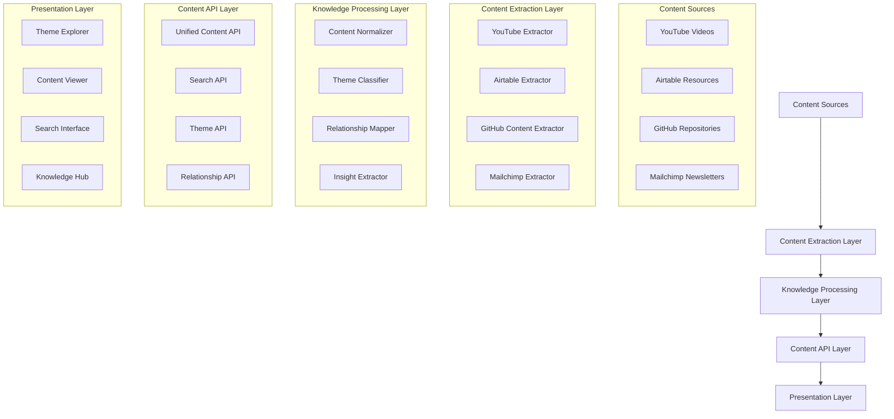

# Design Document: Content Integration System

## Overview

The Content Integration System will transform how users interact with AIME's knowledge resources by focusing on stories, insights, and themes rather than the technical structure of the repositories. This design document outlines the architecture, components, and implementation approach for creating a cohesive, story-focused knowledge platform that integrates content from YouTube, Airtable, GitHub repositories, and other sources.

## Architecture

### High-Level Architecture



### Core Principles

1. **Story-First Approach**: Content is organized around stories, insights, and themes rather than technical structure
2. **Unified Content Model**: All content is normalized into a consistent format regardless of source
3. **Thematic Organization**: Content is primarily organized by theme rather than by source
4. **Relationship-Driven**: The system emphasizes relationships between content items
5. **Progressive Enhancement**: The system works with basic content but enhances the experience when rich metadata is available

## Components and Interfaces

### 1. Content Extraction Layer

This layer is responsible for connecting to various content sources and extracting meaningful content and metadata.

#### YouTube Extractor

**Purpose**: Extract videos, transcripts, and metadata from the IMAGI-NATION {TV} YouTube channel

**Key Functions**:
- Fetch video metadata (title, description, tags, etc.)
- Extract transcripts when available
- Identify key moments and quotes
- Extract themes and topics from video content

**Interface**:
```typescript
interface YouTubeExtractor {
  fetchVideos(options?: FetchOptions): Promise<VideoContent[]>;
  fetchVideoById(id: string): Promise<VideoContent | null>;
  fetchTranscript(videoId: string): Promise<Transcript | null>;
  extractKeyMoments(videoId: string): Promise<KeyMoment[]>;
}
```

#### GitHub Content Extractor

**Purpose**: Extract meaningful content from GitHub repositories rather than just listing files

**Key Functions**:
- Parse markdown files to extract structured content
- Extract text and metadata from PDFs
- Identify themes and topics in repository content
- Map relationships between documents

**Interface**:
```typescript
interface GitHubContentExtractor {
  extractContentFromRepo(repo: string, options?: FetchOptions): Promise<DocumentContent[]>;
  extractContentFromFile(repo: string, path: string): Promise<DocumentContent | null>;
  parseMarkdownContent(content: string): ParsedContent;
  extractPdfContent(url: string): Promise<ParsedContent | null>;
}
```

#### Airtable Extractor

**Purpose**: Extract structured data from Airtable bases

**Key Functions**:
- Fetch records from specified tables
- Transform records into structured content
- Extract relationships between records
- Map records to themes and topics

**Interface**:
```typescript
interface AirtableExtractor {
  fetchResources(options?: FetchOptions): Promise<ResourceContent[]>;
  fetchResourceById(id: string): Promise<ResourceContent | null>;
  fetchEvents(options?: FetchOptions): Promise<EventContent[]>;
  fetchToolkits(options?: FetchOptions): Promise<ToolkitContent[]>;
}
```

### 2. Knowledge Processing Layer

This layer processes the extracted content to normalize it, identify themes, extract insights, and map relationships.

#### Content Normalizer

**Purpose**: Transform content from different sources into a consistent format

**Key Functions**:
- Normalize metadata across all content types
- Extract common fields (title, description, date, etc.)
- Generate consistent identifiers
- Handle missing or incomplete data

**Interface**:
```typescript
interface ContentNormalizer {
  normalizeContent(content: RawContent): NormalizedContent;
  generateContentId(content: RawContent): string;
  extractCommonFields(content: RawContent): CommonFields;
  handleMissingData(content: RawContent): NormalizedContent;
}
```

#### Theme Classifier

**Purpose**: Classify content by theme, topic, and other dimensions

**Key Functions**:
- Identify themes in content based on text and metadata
- Map content to predefined theme taxonomy
- Extract keywords and topics
- Calculate theme relevance scores

**Interface**:
```typescript
interface ThemeClassifier {
  classifyContent(content: NormalizedContent): ClassifiedContent;
  extractThemes(text: string): Theme[];
  mapToThemeTaxonomy(themes: Theme[]): MappedTheme[];
  calculateThemeRelevance(content: NormalizedContent, theme: Theme): number;
}
```

#### Relationship Mapper

**Purpose**: Identify and map relationships between content items

**Key Functions**:
- Identify related content based on themes, topics, and metadata
- Calculate relationship strength
- Map bidirectional relationships
- Identify content sequences and paths

**Interface**:
```typescript
interface RelationshipMapper {
  mapRelationships(content: ClassifiedContent, allContent: ClassifiedContent[]): RelatedContent;
  calculateRelationshipStrength(content1: ClassifiedContent, content2: ClassifiedContent): number;
  identifyContentSequences(content: ClassifiedContent[]): ContentSequence[];
  suggestContentPaths(startContent: ClassifiedContent, allContent: ClassifiedContent[]): ContentPath[];
}
```

### 3. Content API Layer

This layer provides a unified API for accessing processed content.

#### Unified Content API

**Purpose**: Provide a single interface for accessing all content regardless of source

**Key Functions**:
- Fetch content by ID, theme, type, etc.
- Filter content by various criteria
- Sort content by relevance, date, etc.
- Paginate content results

**Interface**:
```typescript
interface UnifiedContentAPI {
  fetchContent(options?: ContentOptions): Promise<ContentItem[]>;
  fetchContentById(id: string): Promise<ContentItem | null>;
  fetchContentByTheme(theme: string, options?: ContentOptions): Promise<ContentItem[]>;
  fetchContentByType(type: ContentType, options?: ContentOptions): Promise<ContentItem[]>;
}
```

#### Search API

**Purpose**: Provide search functionality across all content

**Key Functions**:
- Search content by query
- Rank search results by relevance
- Filter search results
- Suggest related searches

**Interface**:
```typescript
interface SearchAPI {
  searchContent(query: string, options?: SearchOptions): Promise<SearchResult[]>;
  rankSearchResults(results: ContentItem[], query: string): RankedResult[];
  filterSearchResults(results: RankedResult[], filters: SearchFilters): RankedResult[];
  suggestRelatedSearches(query: string): Promise<string[]>;
}
```

### 4. Presentation Layer

This layer is responsible for presenting content to users in a cohesive, story-focused way.

#### Theme Explorer

**Purpose**: Allow users to explore content by theme

**Key Components**:
- Theme navigation
- Content previews
- Theme visualization
- Content filtering

**Interface**:
```typescript
interface ThemeExplorer {
  renderThemeNavigation(themes: Theme[]): JSX.Element;
  renderContentByTheme(theme: Theme, content: ContentItem[]): JSX.Element;
  renderThemeVisualization(themes: Theme[]): JSX.Element;
  renderContentFilters(filters: Filter[]): JSX.Element;
}
```

#### Content Viewer

**Purpose**: Display content with rich context and related items

**Key Components**:
- Content display
- Related content
- Content metadata
- Content navigation

**Interface**:
```typescript
interface ContentViewer {
  renderContent(content: ContentItem): JSX.Element;
  renderRelatedContent(content: ContentItem, relatedContent: ContentItem[]): JSX.Element;
  renderContentMetadata(content: ContentItem): JSX.Element;
  renderContentNavigation(content: ContentItem, path: ContentPath): JSX.Element;
}
```

## Data Models

### Content Item

The core data model that represents any content item regardless of source:

```typescript
type ContentItem = {
  id: string;
  title: string;
  description: string;
  content: string | null;
  contentType: ContentType;
  source: ContentSource;
  url: string;
  thumbnail: string | null;
  date: string | null;
  authors: string[];
  themes: Theme[];
  topics: Topic[];
  tags: string[];
  regions: Region[];
  participantTypes: ParticipantType[];
  relatedContent: RelatedContentItem[];
  insights: Insight[];
  metadata: Record<string, any>;
};

type ContentType = 
  | 'video'
  | 'document'
  | 'resource'
  | 'toolkit'
  | 'event'
  | 'newsletter'
  | 'dashboard';

type ContentSource =
  | 'youtube'
  | 'github'
  | 'airtable'
  | 'mailchimp';

type Theme = {
  id: string;
  name: string;
  description: string;
  relevance: number; // 0-100
};

type RelatedContentItem = {
  id: string;
  relationshipType: RelationshipType;
  strength: number; // 0-100
};

type RelationshipType =
  | 'continues'
  | 'expands'
  | 'contrasts'
  | 'references'
  | 'implements'
  | 'inspires';

type Insight = {
  text: string;
  source: string;
  themes: Theme[];
};
```

### Theme Taxonomy

A structured taxonomy of themes and topics:

```typescript
type ThemeTaxonomy = {
  themes: ThemeDefinition[];
};

type ThemeDefinition = {
  id: string;
  name: string;
  description: string;
  parentTheme: string | null;
  childThemes: string[];
  relatedThemes: string[];
  topics: TopicDefinition[];
};

type TopicDefinition = {
  id: string;
  name: string;
  description: string;
  keywords: string[];
};
```

## Error Handling

### Error Types

```typescript
type ErrorType =
  | 'api_connection_error'
  | 'authentication_error'
  | 'resource_not_found'
  | 'parsing_error'
  | 'validation_error';

type ErrorResponse = {
  type: ErrorType;
  message: string;
  source: string;
  timestamp: string;
  details: Record<string, any>;
};
```

### Error Handling Strategy

1. **Graceful Degradation**: The system will continue to function with partial data if some sources are unavailable
2. **Informative Feedback**: Users will be informed about errors in a non-technical way
3. **Retry Mechanism**: The system will retry failed operations with exponential backoff
4. **Fallback Content**: The system will provide fallback content when primary content is unavailable
5. **Error Logging**: All errors will be logged for monitoring and debugging

## Testing Strategy

### Unit Testing

- Test each component in isolation
- Mock external dependencies
- Test error handling and edge cases
- Ensure high test coverage for core components

### Integration Testing

- Test interactions between components
- Test data flow through the system
- Test error propagation
- Test performance with realistic data volumes

### End-to-End Testing

- Test complete user journeys
- Test with real external services in a staging environment
- Test performance and responsiveness
- Test accessibility and usability

## Implementation Plan

The implementation will follow a phased approach:

### Phase 1: Core Infrastructure

1. Implement the Content Extraction Layer for each source
2. Implement the basic Content Normalizer
3. Create the Unified Content API
4. Develop basic content display components

### Phase 2: Knowledge Processing

1. Implement the Theme Classifier
2. Develop the Relationship Mapper
3. Enhance the Content Normalizer with additional metadata
4. Implement the Search API

### Phase 3: Enhanced Presentation

1. Develop the Theme Explorer
2. Enhance the Content Viewer with related content
3. Implement content paths and sequences
4. Develop rich media presentation components

### Phase 4: Refinement and Optimization

1. Optimize performance for large content volumes
2. Enhance error handling and resilience
3. Improve search relevance and filtering
4. Add advanced visualization and navigation features