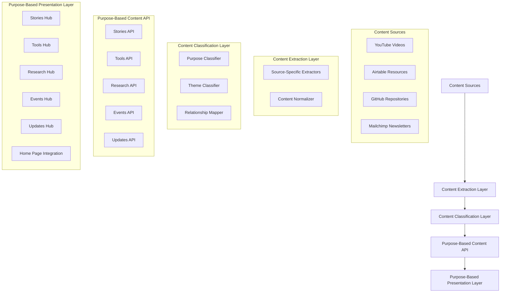

# Design Document: Content Organization by Purpose

## Overview

This design document outlines the architecture, components, and implementation approach for reorganizing the IMAGI-NATION Wiki content by purpose rather than by source. The goal is to create a more intuitive and valuable user experience by categorizing content based on its purpose and value to users, rather than by its technical origin.

The design focuses on creating dedicated content hubs for different content purposes (Stories, Tools, Research, Events, Updates), implementing a consistent metadata schema across all content types, and developing purpose-specific display components that highlight the most relevant aspects of each content type.

## Architecture

### High-Level Architecture



### Core Principles

1. **Purpose-First Organization**: Content is organized by its purpose and value to users rather than by its technical source
2. **Consistent Metadata**: All content uses a consistent metadata schema regardless of source
3. **Relationship-Driven**: Content is connected based on themes and purposes rather than sources
4. **User-Centered Design**: Navigation and presentation are designed around user needs and content purposes
5. **Extensible Architecture**: The system can accommodate new content sources and purposes as they emerge

## Components and Interfaces

### 1. Content Classification Layer

This layer is responsible for classifying content by purpose, theme, and other dimensions.

#### Purpose Classifier

**Purpose**: Classify content by its primary purpose (Stories, Tools, Research, Events, Updates)

**Key Functions**:
- Determine the primary purpose of content based on its characteristics
- Map content to predefined purpose categories
- Calculate purpose relevance scores
- Handle content that may serve multiple purposes

**Interface**:
```typescript
interface PurposeClassifier {
  classifyContentPurpose(content: NormalizedContent): ClassifiedContent;
  getPrimaryPurpose(content: NormalizedContent): ContentPurpose;
  getSecondaryPurposes(content: NormalizedContent): ContentPurpose[];
  calculatePurposeRelevance(content: NormalizedContent, purpose: ContentPurpose): number;
}

type ContentPurpose = 
  | 'story'
  | 'tool'
  | 'research'
  | 'event'
  | 'update';
```

#### Content Taxonomy

**Purpose**: Define a consistent taxonomy of purposes, themes, and topics

**Key Components**:
- Purpose definitions with characteristics and rules
- Theme hierarchy with parent-child relationships
- Topic definitions with keywords and descriptions
- Audience and context classifications

**Interface**:
```typescript
interface ContentTaxonomy {
  purposes: PurposeDefinition[];
  themes: ThemeDefinition[];
  topics: TopicDefinition[];
  audiences: AudienceDefinition[];
  contexts: ContextDefinition[];
}

type PurposeDefinition = {
  id: string;
  name: string;
  description: string;
  characteristics: string[];
  contentTypes: ContentType[];
};
```

### 2. Purpose-Based Content API

This layer provides APIs for accessing content by purpose.

#### Stories API

**Purpose**: Provide access to story-focused content

**Key Functions**:
- Fetch stories by theme, region, or type
- Get featured stories
- Get related stories for any content
- Filter stories by various criteria

**Interface**:
```typescript
interface StoriesAPI {
  fetchStories(options?: ContentOptions): Promise<ContentItem[]>;
  fetchStoryById(id: string): Promise<ContentItem | null>;
  fetchStoriesByTheme(theme: string, options?: ContentOptions): Promise<ContentItem[]>;
  fetchFeaturedStories(limit?: number): Promise<ContentItem[]>;
  fetchRelatedStories(contentId: string, limit?: number): Promise<ContentItem[]>;
}
```

#### Tools API

**Purpose**: Provide access to tool and resource content

**Key Functions**:
- Fetch tools by audience, context, or theme
- Get featured tools
- Get related tools for any content
- Filter tools by various criteria

**Interface**:
```typescript
interface ToolsAPI {
  fetchTools(options?: ContentOptions): Promise<ContentItem[]>;
  fetchToolById(id: string): Promise<ContentItem | null>;
  fetchToolsByAudience(audience: string, options?: ContentOptions): Promise<ContentItem[]>;
  fetchToolsByContext(context: string, options?: ContentOptions): Promise<ContentItem[]>;
  fetchFeaturedTools(limit?: number): Promise<ContentItem[]>;
  fetchRelatedTools(contentId: string, limit?: number): Promise<ContentItem[]>;
}
```

#### Research API

**Purpose**: Provide access to research and insights content

**Key Functions**:
- Fetch research by theme, topic, or type
- Get featured research
- Get related research for any content
- Filter research by various criteria

**Interface**:
```typescript
interface ResearchAPI {
  fetchResearch(options?: ContentOptions): Promise<ContentItem[]>;
  fetchResearchById(id: string): Promise<ContentItem | null>;
  fetchResearchByTheme(theme: string, options?: ContentOptions): Promise<ContentItem[]>;
  fetchResearchByTopic(topic: string, options?: ContentOptions): Promise<ContentItem[]>;
  fetchFeaturedResearch(limit?: number): Promise<ContentItem[]>;
  fetchRelatedResearch(contentId: string, limit?: number): Promise<ContentItem[]>;
}
```

#### Events API

**Purpose**: Provide access to event and program content

**Key Functions**:
- Fetch events by date, type, or region
- Get upcoming events
- Get past events with materials
- Filter events by various criteria

**Interface**:
```typescript
interface EventsAPI {
  fetchEvents(options?: ContentOptions): Promise<ContentItem[]>;
  fetchEventById(id: string): Promise<ContentItem | null>;
  fetchUpcomingEvents(limit?: number): Promise<ContentItem[]>;
  fetchPastEvents(options?: ContentOptions): Promise<ContentItem[]>;
  fetchEventsByRegion(region: string, options?: ContentOptions): Promise<ContentItem[]>;
  fetchEventsByType(type: string, options?: ContentOptions): Promise<ContentItem[]>;
}
```

#### Updates API

**Purpose**: Provide access to update and news content

**Key Functions**:
- Fetch updates by date, theme, or type
- Get latest updates
- Get related updates for any content
- Filter updates by various criteria

**Interface**:
```typescript
interface UpdatesAPI {
  fetchUpdates(options?: ContentOptions): Promise<ContentItem[]>;
  fetchUpdateById(id: string): Promise<ContentItem | null>;
  fetchLatestUpdates(limit?: number): Promise<ContentItem[]>;
  fetchUpdatesByTheme(theme: string, options?: ContentOptions): Promise<ContentItem[]>;
  fetchRelatedUpdates(contentId: string, limit?: number): Promise<ContentItem[]>;
}
```

### 3. Purpose-Based Presentation Layer

This layer is responsible for presenting content based on its purpose.

#### Stories Hub

**Purpose**: Present story-focused content in an engaging way

**Key Components**:
- Featured stories carousel
- Story grid with filtering
- Story detail view with insights and quotes
- Related stories section

**Interface**:
```typescript
interface StoriesHub {
  renderFeaturedStories(stories: ContentItem[]): JSX.Element;
  renderStoryGrid(stories: ContentItem[], filters: StoryFilters): JSX.Element;
  renderStoryDetail(story: ContentItem, relatedStories: ContentItem[]): JSX.Element;
  renderStoryInsights(story: ContentItem): JSX.Element;
}

type StoryFilters = {
  themes?: string[];
  regions?: string[];
  types?: string[];
  dateRange?: DateRange;
};
```

#### Tools Hub

**Purpose**: Present tool and resource content in a practical way

**Key Components**:
- Tool categories navigation
- Tool grid with filtering
- Tool detail view with usage instructions
- Related tools section

**Interface**:
```typescript
interface ToolsHub {
  renderToolCategories(categories: ToolCategory[]): JSX.Element;
  renderToolGrid(tools: ContentItem[], filters: ToolFilters): JSX.Element;
  renderToolDetail(tool: ContentItem, relatedTools: ContentItem[]): JSX.Element;
  renderToolUsage(tool: ContentItem): JSX.Element;
}

type ToolFilters = {
  audiences?: string[];
  contexts?: string[];
  themes?: string[];
  types?: string[];
};

type ToolCategory = {
  id: string;
  name: string;
  description: string;
  icon: string;
};
```

#### Research Hub

**Purpose**: Present research and insights content in an accessible way

**Key Components**:
- Research themes navigation
- Research grid with filtering
- Research detail view with key findings
- Data visualization integration

**Interface**:
```typescript
interface ResearchHub {
  renderResearchThemes(themes: ThemeDefinition[]): JSX.Element;
  renderResearchGrid(research: ContentItem[], filters: ResearchFilters): JSX.Element;
  renderResearchDetail(research: ContentItem, relatedResearch: ContentItem[]): JSX.Element;
  renderDataVisualizations(research: ContentItem): JSX.Element;
}

type ResearchFilters = {
  themes?: string[];
  topics?: string[];
  types?: string[];
  dateRange?: DateRange;
};
```

#### Events Hub

**Purpose**: Present event and program content in a timely way

**Key Components**:
- Events calendar view
- Upcoming events list
- Past events archive
- Event detail view with materials

**Interface**:
```typescript
interface EventsHub {
  renderEventsCalendar(events: ContentItem[]): JSX.Element;
  renderUpcomingEvents(events: ContentItem[]): JSX.Element;
  renderPastEvents(events: ContentItem[], filters: EventFilters): JSX.Element;
  renderEventDetail(event: ContentItem, relatedEvents: ContentItem[]): JSX.Element;
}

type EventFilters = {
  types?: string[];
  regions?: string[];
  dateRange?: DateRange;
};
```

#### Updates Hub

**Purpose**: Present update and news content in a timely way

**Key Components**:
- Latest updates list
- Updates archive with filtering
- Update detail view
- Newsletter subscription integration

**Interface**:
```typescript
interface UpdatesHub {
  renderLatestUpdates(updates: ContentItem[]): JSX.Element;
  renderUpdatesArchive(updates: ContentItem[], filters: UpdateFilters): JSX.Element;
  renderUpdateDetail(update: ContentItem, relatedUpdates: ContentItem[]): JSX.Element;
  renderSubscriptionForm(): JSX.Element;
}

type UpdateFilters = {
  themes?: string[];
  types?: string[];
  dateRange?: DateRange;
};
```

#### Home Page Integration

**Purpose**: Integrate content from all purposes on the home page

**Key Components**:
- Featured stories section
- Latest research insights section
- Tools spotlight section
- Upcoming events section
- Latest updates section

**Interface**:
```typescript
interface HomePageIntegration {
  renderFeaturedStories(stories: ContentItem[]): JSX.Element;
  renderLatestResearch(research: ContentItem[]): JSX.Element;
  renderToolsSpotlight(tools: ContentItem[]): JSX.Element;
  renderUpcomingEvents(events: ContentItem[]): JSX.Element;
  renderLatestUpdates(updates: ContentItem[]): JSX.Element;
}
```

## Data Models

### Enhanced Content Item

The core data model is enhanced to support purpose-based organization:

```typescript
type EnhancedContentItem = {
  id: string;
  title: string;
  description: string;
  content?: string;
  contentType: ContentType;
  source: ContentSource;
  url: string;
  thumbnail?: string;
  date?: string;
  authors?: string[];
  
  // Purpose-based fields
  primaryPurpose: ContentPurpose;
  secondaryPurposes?: ContentPurpose[];
  purposeRelevance: number; // 0-100
  
  // Classification fields
  themes?: Theme[];
  topics?: Topic[];
  tags?: string[];
  regions?: Region[];
  audiences?: Audience[];
  contexts?: Context[];
  
  // Relationship fields
  relatedContent?: RelatedContentItem[];
  insights?: Insight[];
  
  // Purpose-specific fields
  storyDetails?: StoryDetails;
  toolDetails?: ToolDetails;
  researchDetails?: ResearchDetails;
  eventDetails?: EventDetails;
  updateDetails?: UpdateDetails;
  
  // Technical fields
  metadata?: Record<string, any>;
};

type ContentPurpose = 
  | 'story'
  | 'tool'
  | 'research'
  | 'event'
  | 'update';

type StoryDetails = {
  storyType: 'personal' | 'case_study' | 'impact' | 'journey';
  keyQuotes?: string[];
  keyMoments?: KeyMoment[];
  protagonists?: string[];
  narrative?: string;
};

type ToolDetails = {
  toolType: 'implementation' | 'worksheet' | 'guide' | 'toolkit' | 'template';
  usageInstructions?: string;
  targetAudience?: string[];
  implementationContext?: string[];
  prerequisites?: string[];
};

type ResearchDetails = {
  researchType: 'finding' | 'analysis' | 'synthesis' | 'data' | 'report';
  keyFindings?: string[];
  methodology?: string;
  dataPoints?: DataPoint[];
  visualizations?: Visualization[];
};

type EventDetails = {
  eventType: 'workshop' | 'webinar' | 'training' | 'conference' | 'meeting';
  startDate?: string;
  endDate?: string;
  location?: string;
  registrationUrl?: string;
  materials?: EventMaterial[];
  speakers?: string[];
};

type UpdateDetails = {
  updateType: 'newsletter' | 'announcement' | 'news' | 'release';
  publicationDate?: string;
  publisher?: string;
  callToAction?: string;
  highlights?: string[];
};
```

### Purpose-Based Content Options

Options for fetching content by purpose:

```typescript
type PurposeContentOptions = ContentOptions & {
  primaryPurpose?: ContentPurpose;
  secondaryPurposes?: ContentPurpose[];
  minPurposeRelevance?: number; // 0-100
};

type StoryOptions = PurposeContentOptions & {
  storyType?: string;
  protagonists?: string[];
};

type ToolOptions = PurposeContentOptions & {
  toolType?: string;
  audience?: string[];
  context?: string[];
};

type ResearchOptions = PurposeContentOptions & {
  researchType?: string;
  methodology?: string;
};

type EventOptions = PurposeContentOptions & {
  eventType?: string;
  dateFrom?: string;
  dateTo?: string;
  location?: string;
};

type UpdateOptions = PurposeContentOptions & {
  updateType?: string;
  publicationDate?: string;
  publisher?: string;
};
```

## Navigation Structure

The navigation structure is reorganized around content purposes:

```
Home
├── Stories & Narratives
│   ├── Video Stories
│   ├── Written Narratives
│   ├── Impact Stories
│   └── Story Explorer
├── Tools & Resources
│   ├── Implementation Toolkits
│   ├── Worksheets & Guides
│   ├── Templates
│   └── Resource Explorer
├── Research & Insights
│   ├── Research Findings
│   ├── Data Analysis
│   ├── Synthesis Documents
│   └── Research Explorer
├── Events & Programs
│   ├── Upcoming Events
│   ├── Past Events Archive
│   ├── Training Programs
│   └── Event Calendar
├── Updates & News
│   ├── Latest Updates
│   ├── Newsletters
│   ├── Announcements
│   └── Updates Archive
└── About
    ├── Project Overview
    ├── Team
    ├── Partners
    └── Contact
```

## URL Structure

The URL structure reflects the purpose-based organization:

```
/                           # Home page
/stories                    # Stories & Narratives hub
/stories/video              # Video stories
/stories/written            # Written narratives
/stories/impact             # Impact stories
/stories/{id}               # Individual story

/tools                      # Tools & Resources hub
/tools/implementation       # Implementation toolkits
/tools/worksheets           # Worksheets & guides
/tools/templates            # Templates
/tools/{id}                 # Individual tool

/research                   # Research & Insights hub
/research/findings          # Research findings
/research/analysis          # Data analysis
/research/synthesis         # Synthesis documents
/research/{id}              # Individual research item

/events                     # Events & Programs hub
/events/upcoming            # Upcoming events
/events/past                # Past events archive
/events/training            # Training programs
/events/{id}                # Individual event

/updates                    # Updates & News hub
/updates/latest             # Latest updates
/updates/newsletters        # Newsletters
/updates/announcements      # Announcements
/updates/{id}               # Individual update

/about                      # About section
/about/overview             # Project overview
/about/team                 # Team
/about/partners             # Partners
/about/contact              # Contact
```

## Error Handling

### Error Types

```typescript
type PurposeErrorType =
  | 'purpose_classification_error'
  | 'content_mapping_error'
  | 'taxonomy_error'
  | 'relationship_error'
  | 'api_error';

type PurposeErrorResponse = {
  type: PurposeErrorType;
  message: string;
  source: string;
  timestamp: string;
  details?: Record<string, any>;
};
```

### Error Handling Strategy

1. **Graceful Degradation**: If purpose classification fails, fall back to source-based organization
2. **Default Purposes**: Assign default purposes based on content type if classification is uncertain
3. **Multiple Purposes**: Allow content to appear in multiple purpose hubs if it serves multiple purposes
4. **User Feedback**: Provide mechanisms for users to suggest better purpose classifications
5. **Monitoring**: Track purpose classification accuracy and improve over time

## Testing Strategy

### Unit Testing

- Test purpose classification algorithms with various content types
- Test purpose-based APIs with mock data
- Test purpose-specific components in isolation
- Ensure high test coverage for core components

### Integration Testing

- Test the flow from content extraction to purpose-based presentation
- Test navigation between different purpose hubs
- Test content relationships across purposes
- Test search and filtering within purpose hubs

### User Testing

- Test the purpose-based navigation with real users
- Gather feedback on purpose classifications
- Evaluate the effectiveness of purpose-specific presentations
- Measure user satisfaction and task completion rates

## Implementation Plan

The implementation will follow a phased approach:

### Phase 1: Content Classification

1. Implement the Purpose Classifier
2. Enhance the Content Normalizer to support purpose-based fields
3. Define the Content Taxonomy for purposes, themes, and topics
4. Implement purpose classification for existing content

### Phase 2: Purpose-Based APIs

1. Implement the Stories API
2. Implement the Tools API
3. Implement the Research API
4. Implement the Events API
5. Implement the Updates API

### Phase 3: Purpose-Based Presentation

1. Implement the Stories Hub
2. Implement the Tools Hub
3. Implement the Research Hub
4. Implement the Events Hub
5. Implement the Updates Hub

### Phase 4: Navigation and Integration

1. Implement the purpose-based navigation structure
2. Implement the Home Page Integration
3. Update the URL structure
4. Implement cross-purpose relationships and recommendations