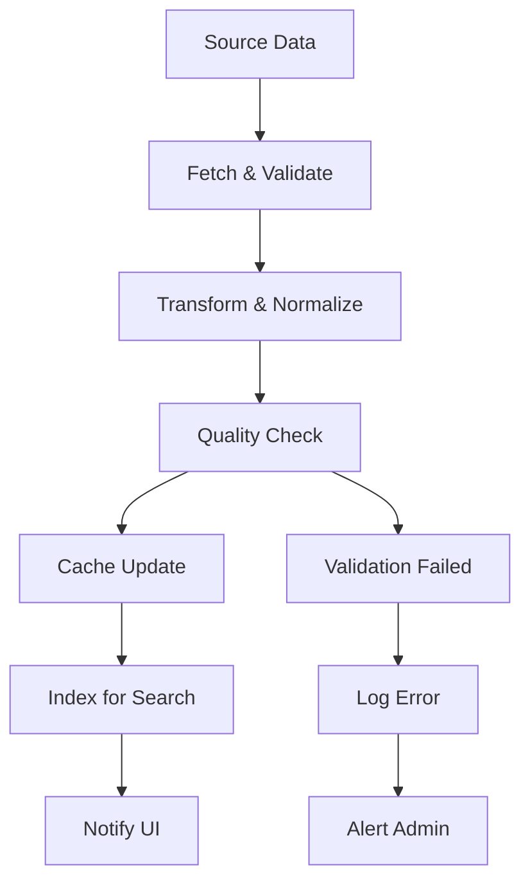

# 🔄 AIME Data Synchronization Architecture

## 📋 Executive Summary

This document outlines a professional, scalable system for synchronizing data from multiple sources into the AIME Knowledge Archive. The architecture supports real-time updates, scheduled syncing, content validation, and intelligent caching.

## 🎯 Current Data Sources

### ✅ **Active Integrations**
- **Mailchimp** - 10+ newsletters (real-time)
- **Airtable** - 20+ resources from DAM + COMMS bases (real-time) 
- **GitHub** - 2+ repositories with documentation (real-time)
- **Local Markdown** - 5+ wiki files (file-system based)

### 🔮 **Planned Integrations**
- **YouTube** - IMAGI-NATION TV episodes
- **Additional Airtable Bases** - More structured data
- **External APIs** - Partner content feeds
- **Media Assets** - Images, videos, documents
- **Analytics Data** - Usage and engagement metrics

## 🏗️ Synchronization Architecture

### 1. **Multi-Layer Sync System**

```
┌─────────────────────────────────────────────────────────────┐
│                    AIME Knowledge Archive                    │
├─────────────────────────────────────────────────────────────┤
│ Layer 4: User Interface (React/Next.js)                    │
├─────────────────────────────────────────────────────────────┤
│ Layer 3: API Gateway & Content Aggregation                 │
├─────────────────────────────────────────────────────────────┤
│ Layer 2: Sync Orchestration & Scheduling                   │
├─────────────────────────────────────────────────────────────┤
│ Layer 1: Source Integrations & Data Fetching               │
└─────────────────────────────────────────────────────────────┘
```

### 2. **Sync Strategy by Source Type**

| Source | Sync Method | Frequency | Caching | Priority |
|--------|-------------|-----------|---------|----------|
| **Mailchimp** | API Polling | 1 hour | 4 hours | High |
| **Airtable** | API Polling | 30 minutes | 2 hours | High |
| **GitHub** | Webhook + Polling | Real-time + 1 hour | 1 hour | Medium |
| **Local Files** | File Watcher | Real-time | None | High |
| **YouTube** | API Polling | 6 hours | 12 hours | Medium |

### 3. **Content Lifecycle Management**



## 🛠️ Implementation Plan

### Phase 1: **Foundation** (Current - Week 1)
- ✅ Environment security system
- ✅ Basic API integrations
- ✅ Real-time data fetching
- 🔄 **Sync orchestration framework** (In Progress)

### Phase 2: **Automation** (Week 2)
- 📅 Scheduled sync jobs
- 🔄 Background processing
- ⚡ Intelligent caching
- 📊 Sync monitoring dashboard

### Phase 3: **Scaling** (Week 3-4)
- 🚀 Performance optimization
- 📈 Analytics integration
- 🎥 YouTube content pipeline
- 🔍 Advanced search features

### Phase 4: **Intelligence** (Week 4+)
- 🤖 AI content analysis
- 📝 Automatic tagging
- 🔗 Content relationship mapping
- 💡 Recommendation engine

## 💾 Data Storage Strategy

### 1. **Hybrid Storage Approach**
- **Real-time Cache** - Redis for frequently accessed content
- **File-based Storage** - For static content and backups
- **Database Option** - PostgreSQL for complex relationships (future)

### 2. **Content Versioning**
- Track content changes over time
- Maintain edit history
- Support rollback capabilities

### 3. **Backup Strategy**
- **Incremental backups** every hour
- **Full backups** daily
- **Off-site storage** weekly

## 🔄 Sync Job Architecture

### 1. **Job Types**
- **Full Sync** - Complete data refresh (daily)
- **Incremental Sync** - Only changed content (hourly)
- **Priority Sync** - High-importance sources (real-time)
- **Cleanup Jobs** - Remove stale data (weekly)

### 2. **Error Handling**
- **Retry Logic** - Exponential backoff for failed requests
- **Circuit Breaker** - Pause failing integrations temporarily
- **Fallback Data** - Serve cached content when APIs fail
- **Alert System** - Notify administrators of critical issues

### 3. **Rate Limiting**
- **Mailchimp** - 10 requests/second max
- **Airtable** - 5 requests/second max
- **GitHub** - 5000 requests/hour with auth
- **YouTube** - 10,000 quota units/day

## 📊 Monitoring & Analytics

### 1. **Sync Health Dashboard**
- Real-time sync status
- Success/failure rates
- Response time metrics
- Data freshness indicators

### 2. **Content Analytics**
- Most popular content
- Source contribution analysis
- Search query patterns
- User engagement metrics

### 3. **System Alerts**
- API failures or rate limits
- Data quality issues
- Performance degradation
- Security concerns

## 🔐 Security & Compliance

### 1. **API Security**
- Encrypted API key storage
- Token rotation policies
- Access logging
- Rate limit enforcement

### 2. **Data Privacy**
- Content sanitization
- PII detection and masking
- Compliance with data protection laws
- Audit trail maintenance

### 3. **Access Control**
- Role-based permissions
- Content visibility rules
- Administrator workflows
- Guest user limitations

## 🚀 Performance Optimization

### 1. **Caching Strategy**
- **L1 Cache** - Browser (5 minutes)
- **L2 Cache** - CDN (1 hour)
- **L3 Cache** - Application (4 hours)
- **L4 Cache** - Database (24 hours)

### 2. **Lazy Loading**
- Load content on demand
- Prioritize above-the-fold content
- Background prefetching
- Infinite scroll for large datasets

### 3. **Content Delivery**
- Image optimization and compression
- Video streaming optimization
- Static asset CDN
- Geographic content distribution

## 🎛️ Configuration Management

### 1. **Environment-based Settings**
```
Development:
- Sync every 15 minutes
- Verbose logging
- Mock data fallbacks

Production:
- Sync every 5 minutes
- Error-only logging
- High availability mode
```

### 2. **Feature Flags**
- Enable/disable specific integrations
- A/B test new features
- Gradual rollout capabilities
- Emergency shutoff switches

## 📝 Content Quality Assurance

### 1. **Validation Rules**
- Required field checking
- Data format validation
- Content length limits
- Image and media verification

### 2. **Content Enhancement**
- Automatic tag generation
- SEO optimization
- Accessibility improvements
- Mobile-friendly formatting

### 3. **Duplicate Detection**
- Cross-source deduplication
- Similar content identification
- Version conflict resolution
- Canonical URL assignment

## 🔮 Future Roadmap

### Short-term (1-3 months)
- Complete YouTube integration
- Advanced search capabilities
- Mobile app API
- Analytics dashboard

### Medium-term (3-6 months)
- AI-powered content analysis
- Multi-language support
- Advanced filtering
- Collaboration features

### Long-term (6+ months)
- Machine learning recommendations
- Predictive content curation
- External API marketplace
- White-label solutions

## 🎯 Success Metrics

### Technical KPIs
- **Uptime**: >99.9%
- **Sync Latency**: <5 minutes
- **API Success Rate**: >99%
- **Page Load Time**: <2 seconds

### Content KPIs
- **Data Freshness**: <1 hour old
- **Content Quality Score**: >8/10
- **Search Relevance**: >90%
- **User Satisfaction**: >4.5/5

## 💼 Team Responsibilities

### Data Engineering
- API integration maintenance
- Sync job optimization
- Performance monitoring
- Infrastructure scaling

### Content Management
- Quality assurance processes
- Content categorization
- Editorial workflows
- Community guidelines

### DevOps
- System monitoring
- Security compliance
- Backup management
- Incident response

---

**Next Steps**: Implement the sync orchestration framework and automated job scheduling system.