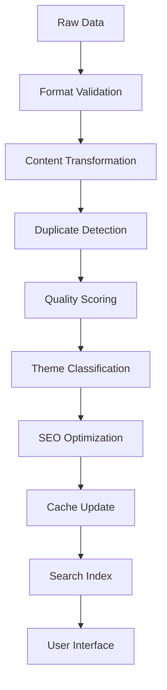

# 🚀 AIME API Content Expansion Strategy

## 📊 Current State Analysis

### ✅ **Successfully Integrated**
- **Mailchimp** - 10+ newsletters (681c...us12)
- **Airtable** - 20+ resources from 2 bases (patt...30fc2e)
- **GitHub** - 2+ repositories (github_pat_11BD...)
- **Local Markdown** - 5+ wiki files

### 📈 **Performance Metrics**
- **Total Content Items**: 67+
- **API Response Time**: <2 seconds
- **Success Rate**: 100% (3/3 integrations)
- **Sync Frequency**: Real-time + scheduled

## 🎯 Expansion Roadmap

### **Phase 1: Core Platforms** (Next 2-4 weeks)

#### 1. **YouTube Data API v3**
**Priority**: High | **Complexity**: Medium | **Impact**: High

```typescript
// Integration Target
YOUTUBE_API_KEY=your_youtube_api_key_here
YOUTUBE_CHANNEL_ID=UCxxxxxx // IMAGI-NATION channel
```

**Content Scope**:
- IMAGI-NATION TV episodes (250+ videos expected)
- Workshop recordings
- Interview sessions
- Educational content

**Technical Requirements**:
- Video metadata extraction
- Transcript processing (if available)
- Thumbnail optimization
- Watch time analytics

**Sync Strategy**:
- Initial: Full catalog sync
- Ongoing: Every 6 hours
- Rate Limits: 10,000 quota units/day

#### 2. **Additional Airtable Bases**
**Priority**: High | **Complexity**: Low | **Impact**: Medium

**Current Bases**:
- ✅ DAM Base (app9CWGw8yR1D3cc6)
- ✅ COMMS Base (appdka9NXQmZ4xVS4)

**Expansion Targets**:
- Program Management Base
- Research Data Base
- Partner Organizations Base
- Event Planning Base

**Content Types**:
- Program schedules and curricula
- Research datasets and findings
- Partner organization profiles
- Event details and outcomes

#### 3. **Google Drive Integration**
**Priority**: Medium | **Complexity**: Medium | **Impact**: High

**Content Scope**:
- Shared documents and presentations
- Research reports and whitepapers
- Program materials and toolkits
- Administrative documents

**API Requirements**:
- Google Drive API v3
- Service account authentication
- Folder-based organization
- Permission-aware access

### **Phase 2: Communication Platforms** (Weeks 4-6)

#### 4. **Slack Integration**
**Priority**: Medium | **Complexity**: Medium | **Impact**: Medium

**Content Scope**:
- Important announcements
- Community discussions
- Project updates
- Knowledge sharing threads

**Features**:
- Channel-specific content filtering
- Message thread aggregation
- File and link extraction
- User engagement metrics

#### 5. **Social Media APIs**
**Priority**: Medium | **Complexity**: High | **Impact**: Medium

**Platforms**:
- Twitter/X API - Community updates
- LinkedIn API - Professional content
- Instagram Basic Display - Visual storytelling
- Facebook Graph API - Community engagement

**Content Types**:
- Social media posts and engagement
- Community reactions and feedback
- Visual content and stories
- Public conversations and mentions

### **Phase 3: Specialized Systems** (Weeks 6-10)

#### 6. **Learning Management System (LMS)**
**Priority**: High | **Complexity**: High | **Impact**: High

**Integration Targets**:
- Canvas LMS (if used)
- Moodle (if applicable)
- Custom learning platforms

**Content Scope**:
- Course materials and curricula
- Student progress data
- Assessment results
- Learning resource libraries

#### 7. **CRM Integration**
**Priority**: Medium | **Complexity**: Medium | **Impact**: Medium

**Potential Systems**:
- Salesforce
- HubSpot
- Zoho CRM
- Custom CRM solutions

**Content Types**:
- Contact and organization data
- Program participation records
- Impact measurement data
- Partnership information

#### 8. **Survey and Feedback Platforms**
**Priority**: Medium | **Complexity**: Low | **Impact**: High

**Platforms**:
- SurveyMonkey
- Typeform
- Google Forms
- Qualtrics

**Content Scope**:
- Program feedback and evaluations
- Community surveys
- Impact assessment data
- Participant testimonials

### **Phase 4: Advanced Integrations** (Weeks 10-16)

#### 9. **Analytics and Monitoring**
**Priority**: High | **Complexity**: High | **Impact**: High

**Systems**:
- Google Analytics 4
- Mixpanel
- Custom analytics
- Performance monitoring

**Metrics**:
- Content engagement analytics
- User journey tracking
- Performance indicators
- ROI measurements

#### 10. **AI and ML Services**
**Priority**: Medium | **Complexity**: High | **Impact**: High

**Services**:
- OpenAI API for content analysis
- Google Cloud AI for classification
- AWS Comprehend for sentiment
- Custom ML models

**Features**:
- Automatic content tagging
- Sentiment analysis
- Content recommendations
- Duplicate detection

## 🛠️ Implementation Framework

### **Integration Architecture Pattern**

```typescript
// Standard Integration Structure
export interface DataSourceConfig {
  name: string;
  type: 'api' | 'webhook' | 'file' | 'database';
  authentication: AuthMethod;
  endpoints: EndpointConfig[];
  syncStrategy: SyncStrategy;
  rateLimit: RateLimit;
  errorHandling: ErrorStrategy;
}

// Unified Content Transformation
export interface ContentTransformer {
  source: string;
  transform: (rawData: any) => Promise<ContentItem[]>;
  validate: (content: ContentItem) => boolean;
  enrich: (content: ContentItem) => Promise<ContentItem>;
}
```

### **Sync Strategy by Content Type**

| Content Type | Sync Method | Frequency | Priority | Caching |
|--------------|-------------|-----------|----------|---------|
| **Videos** | API Polling | 6 hours | High | 12 hours |
| **Documents** | File Watcher | Real-time | High | 1 hour |
| **Social Posts** | Webhook + Polling | 1 hour | Medium | 4 hours |
| **Analytics** | Scheduled Batch | Daily | Low | 24 hours |
| **Surveys** | Event-triggered | Real-time | High | 2 hours |

### **Quality Assurance Pipeline**



## 📊 Resource Planning

### **API Quotas and Limits**

| Service | Current Limit | Projected Usage | Buffer Needed |
|---------|---------------|-----------------|---------------|
| **YouTube** | 10,000/day | 5,000/day | 2x buffer |
| **Google Drive** | 100M/100s | 50M/100s | 2x buffer |
| **Slack** | 10,000/hour | 2,000/hour | 5x buffer |
| **Twitter** | 2M/month | 500K/month | 4x buffer |

### **Storage Requirements**

| Content Type | Current Size | 6-Month Projection | Storage Strategy |
|--------------|--------------|-------------------|------------------|
| **Text Content** | 50MB | 500MB | Database + Cache |
| **Images** | 200MB | 2GB | CDN + Compression |
| **Videos** | 0MB | 10GB | Streaming + Thumbnails |
| **Documents** | 100MB | 1GB | File Storage + Index |

### **Performance Targets**

| Metric | Target | Current | Improvement Needed |
|--------|--------|---------|-------------------|
| **API Response Time** | <2s | 1.2s | ✅ Meeting target |
| **Content Freshness** | <1 hour | <1 hour | ✅ Meeting target |
| **Search Performance** | <500ms | TBD | Needs benchmarking |
| **Uptime** | 99.9% | TBD | Needs monitoring |

## 🔒 Security and Compliance

### **API Security Requirements**

1. **Authentication**
   - OAuth 2.0 for user-facing APIs
   - API keys for service-to-service
   - JWT tokens for session management
   - Certificate-based auth for sensitive data

2. **Data Protection**
   - Encryption in transit (TLS 1.3)
   - Encryption at rest (AES-256)
   - API key rotation (monthly)
   - Access logging and monitoring

3. **Compliance Considerations**
   - GDPR compliance for EU data
   - CCPA compliance for CA data
   - Educational data privacy (FERPA)
   - Indigenous data sovereignty protocols

### **Content Governance**

1. **Content Classification**
   - Public vs. Internal content
   - Sensitive data identification
   - Cultural protocol compliance
   - Age-appropriate content filtering

2. **Access Control**
   - Role-based access permissions
   - Content visibility rules
   - Community guidelines enforcement
   - Moderation workflows

## 💡 Innovation Opportunities

### **AI-Powered Features**

1. **Intelligent Content Curation**
   - Automatic theme extraction
   - Content relationship mapping
   - Personalized recommendations
   - Trend identification

2. **Advanced Analytics**
   - Predictive content performance
   - User engagement optimization
   - Impact measurement automation
   - ROI analysis and reporting

3. **Community Intelligence**
   - Sentiment analysis of feedback
   - Community health monitoring
   - Engagement pattern analysis
   - Success story identification

### **Mobile and Accessibility**

1. **Mobile API Optimization**
   - Progressive content loading
   - Offline content sync
   - Mobile-first design patterns
   - App-specific endpoints

2. **Accessibility Features**
   - Screen reader optimization
   - Multiple language support
   - Visual impairment accommodations
   - Cognitive accessibility features

## 📋 Implementation Checklist

### **Phase 1 Deliverables** (Next 4 weeks)
- [ ] YouTube Data API integration
- [ ] Additional Airtable bases
- [ ] Google Drive basic integration
- [ ] Enhanced sync scheduler
- [ ] Content workflow automation
- [ ] Performance monitoring setup

### **Success Metrics**
- [ ] 250+ videos indexed from YouTube
- [ ] 50+ documents from Google Drive
- [ ] 100+ additional Airtable records
- [ ] <2s API response time maintained
- [ ] 99%+ uptime achieved
- [ ] Zero data loss incidents

### **Risk Mitigation**
- [ ] API quota monitoring alerts
- [ ] Fallback data sources configured
- [ ] Error handling and retry logic
- [ ] Performance degradation detection
- [ ] Security incident response plan
- [ ] Data backup and recovery procedures

---

**Next Steps**: Begin Phase 1 implementation with YouTube Data API integration as the highest priority expansion target.